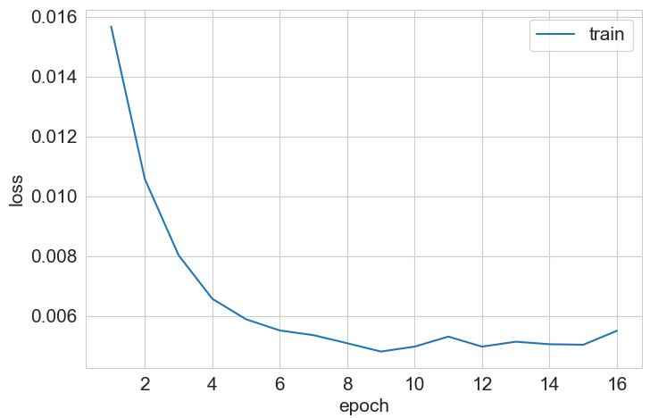
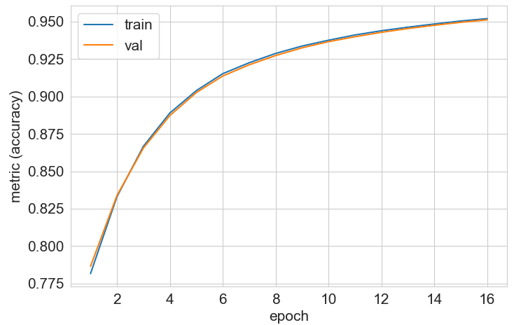

<h1 align="center">Bert classifier with MixUp augmentation</h1>

## Описание проекта

Проект демонстрирует использование метода <a href='https://paperswithcode.com/method/mixup'>MixUp</a> для аугментации данных на уровне эмбеддингов при обучении <a href='https://huggingface.co/google-bert/bert-base-cased'>bert-base-cased</a> модели на датасете <a href='https://huggingface.co/datasets/rotten_tomatoes'>Rotten Tomatoes</a>.


## Структура проекта

- `data/`: Директория для данных
- `models/`: Директория для сохраненных моделей
- `notebooks/`: Директория для Jupyter notebooks (EDA, анализ данных)
- `scripts/`: Директория для скриптов
  - `train.py`: Обучения модели
  - `test.py`: Тестирование модели
  - `preprocess.py`: Токенизация данных
  - `mixup.py`: Реализация метода MixUp
  - `utils.py`: Вспомогательные функции
- `src/`: Директория для сохранения данных
- `requirements.txt`: Зависимости проекта

## Запуск проекта 
#### Дообучение модели

```
  python train.py --modelname modelname
```

#### Тестирование дообученной модели

```
  python test.py --modelname modelname
```

## Результаты 

#### График функции потерь (Binary Cross Entropy) на обучающей выборке

<p align="center">
  
</p>

#### График метрики качества (Accuracy score) на обучающей и валидационной выборках

<p align="center">
  
</p>

#### Качество классификации на тестовой выборке

  - `accuracy`: 0.8470
  - `precision `: 0.8571
  - `recall `: 0.8330
  - `f1`: 0.8449


